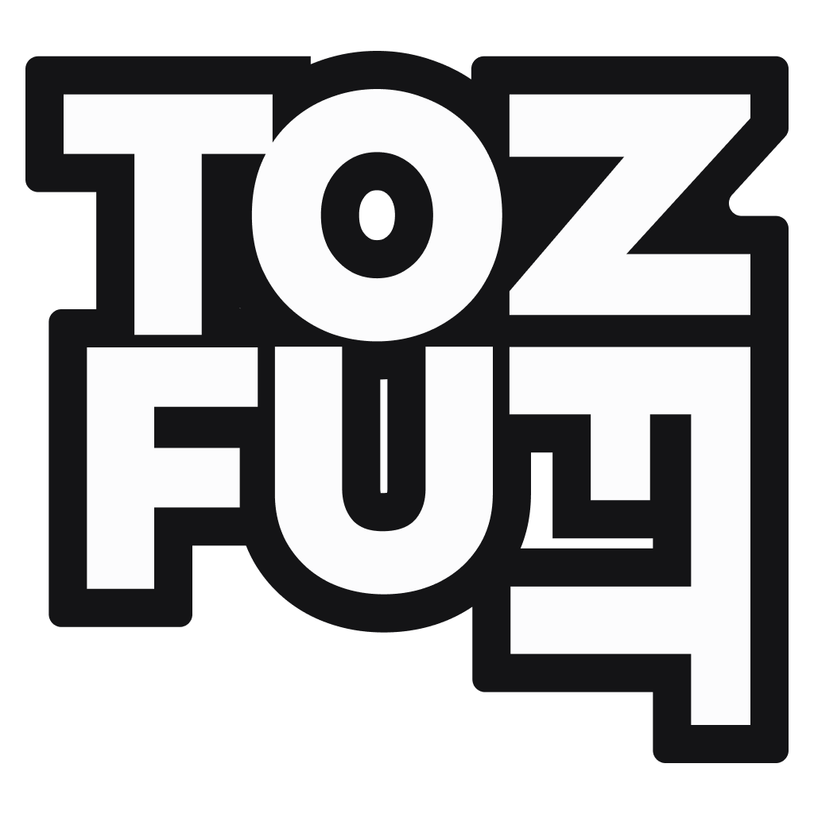

# Minting

## Minting Function

The 1000 CZ NFT will be minted at our official website and the ERC721 contract will be verified by  &#x20;

Partners enjoys benefits like: ・Verified Mark ・Dedicated NFT Collection Page ・Attribute Filter & Rarity Ranking

## Minting Button  [🛎️](https://emojipedia.org/bellhop-bell/)

&#x20;                                                          **The Minting Button of CzNFT preview**&#x20;

<figure><figcaption></figcaption></figure>


**Please aware that the Minting will be started before the Project Presale on Pinksale**&#x20;

**All NFT minting will be added to Token Presale whitelist**&#x20;

## **Minting Price**&#x20;

**Free** [🛎️](https://emojipedia.org/bellhop-bell/)for Whitelist address ! (Please pay attention to the official announment)&#x20;

0.**15**BNB for public minting

TOTAL SUPPLY: 500 (Presale Stage)

MAX MINT: 1 PER WALLET

💎90% FUNDS INTO BUYBACKS

💎10% AUTO-BUYBACK AND REWARDED TO HOLDERS OF THE NEW COLLECTION

