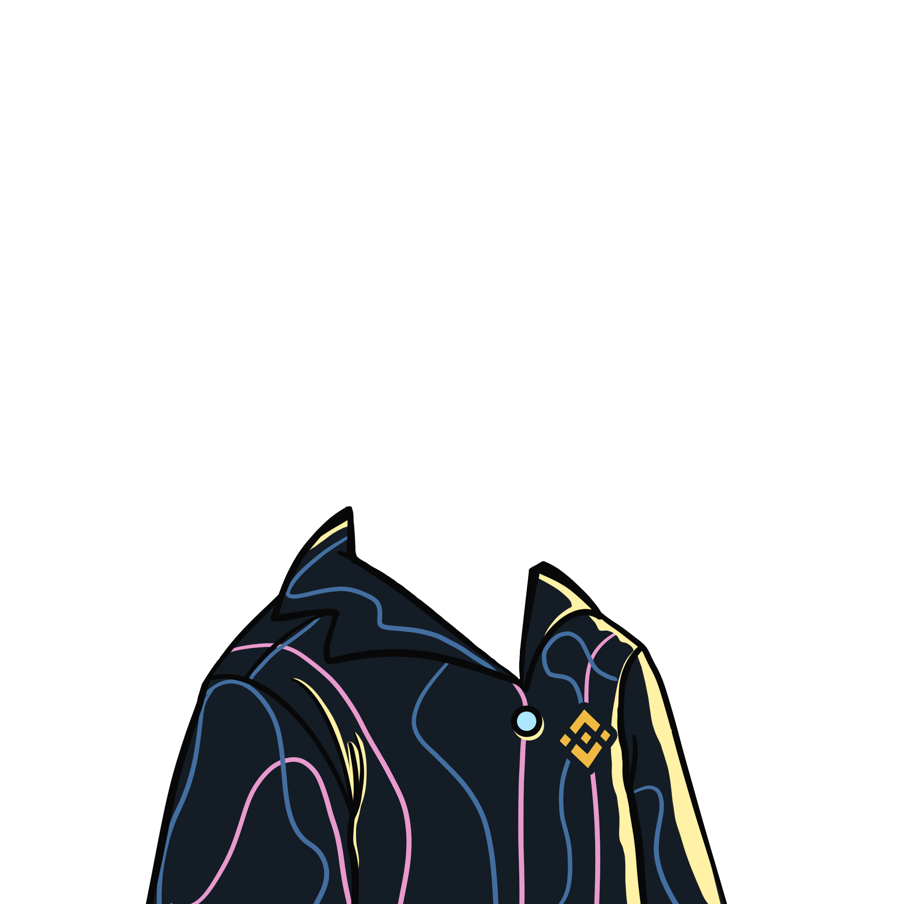
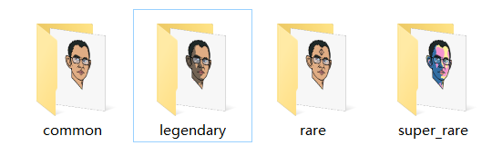

# NFT Design Details

## The MetaData of CZNFT&#x20;

## **HEAD**

<figure><figcaption>
SuperRare- ShadowHead
</figcaption></figure>

## OUTFIT &#x20;

<figure><figcaption>
SuperRare OUTFIT
</figcaption></figure>

## Background&#x20;

<figure><figcaption>
SuperRare Space
</figcaption></figure>

## Final NFT Preview&#x20;

<figure><figcaption></figcaption></figure>

## Total Supply of CZNFT

1,000 unique collectible characters with proof of ownership stored on the Binance Smart Chain

****

## Utility

1. NFT staking
2. NFT Sharing of BEP-20 Marketing Wallet
3. Marketplace trading&#x20;
4. Collection &#x20;

## Rarity&#x20;


SuperRare>Rare>legendary>Common

